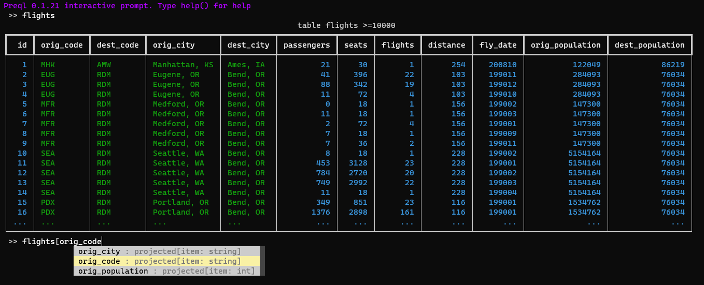

Preql is an interpreted, relational programming language, that specializes in database queries.

It is designed for use by data engineers, analysts and data scientists.

Preql's main objective is to provide an alternative to SQL, in the form of a high-level programming language, with first-class functions, modules, strict typing, and Python integration.

**How does it work?**

Preql code is interpreted and gets compiled to SQL at runtime. This way, Preql gains the performance and abilities of SQL, but can also operate as a normal scripting language.

Currently supported dialects are:
* Postgres
* MySQL
* Sqlite
* BigQuery
* More... (planned)

For features that are database-specific, or aren't implemented in Preql, there is a `SQL()` function that provides a convenient escape hatch to write raw SQL code.

**Main Features**

* Modern syntax and semantics
    - Interpreted, everything is an object
    - Strong type system with gradual type validation and duck-typing
* Compiles to SQL
* Python and Pandas integration
* Interactive shell (REPL) with auto-completion
* Runs on Jupyter Notebook


**Note: Preql is still work in progress, and isn't yet recommended for use in production.**

[](https://github.com/erezsh/Preql/actions/workflows/tests.yml)

# Learn More

- [**Read the documentation**](https://preql.readthedocs.io/en/latest/)

- [Follow the tutorial](https://preql.readthedocs.io/en/latest/tutorial.html)

- [Browse the examples](https://github.com/erezsh/Preql/tree/master/examples)

- Check out the online demo: [](https://mybinder.org/v2/gh/erezsh/preql-binder/master?filepath=tutorial_exploring_a_database.ipynb)

# Get started

Simply install via pip:

```sh
    pip install -U preql
```

Then just run the interpreter:

```sh
    preql
```

Requires Python 3.6+

[Read more](https://preql.readthedocs.io/en/latest/getting-started.html)

# Quick Example

```javascript
// Declare a new table
table Continent {
    name: string
    area: int       // km²
    population: int
}

// Initialize the table, by inserting rows
new Continent("Africa", 30370000, 1287920000)
new Continent("Antarctica", 14000000, 4490)
new Continent("Asia", 44579000, 4545133000)
new Continent("Europe", 10180000, 742648000)
new Continent("North America", 24709000, 587615000)
new Continent("South America", 17840000, 428240000)
new Continent("Australia", 8600000, 41261000)

// Print the continents, ordered by density
print Continent {
    ...                         // Include existing fields
    density: population / area  // Create new a field

} order{^density}

// Print the total land area
print "Total land area:", sum(Continent{area}), "km²"

//  ========================= Output ==========================

                              table  =7
┏━━━━┳━━━━━━━━━━━━━━━┳━━━━━━━━━━┳━━━━━━━━━━━━┳━━━━━━━━━━━━━━━━━━━━━━━┓
┃ id ┃ name          ┃     area ┃ population ┃               density ┃
┡━━━━╇━━━━━━━━━━━━━━━╇━━━━━━━━━━╇━━━━━━━━━━━━╇━━━━━━━━━━━━━━━━━━━━━━━┩
│  3 │ Asia          │ 44579000 │ 4545133000 │     101.9568182328002 │
│  4 │ Europe        │ 10180000 │  742648000 │      72.9516699410609 │
│  1 │ Africa        │ 30370000 │ 1287920000 │     42.40763911755021 │
│  6 │ South America │ 17840000 │  428240000 │    24.004484304932735 │
│  5 │ North America │ 24709000 │  587615000 │    23.781415678497712 │
│  7 │ Australia     │  8600000 │   41261000 │     4.797790697674419 │
│  2 │ Antarctica    │ 14000000 │       4490 │ 0.0003207142857142857 │
└────┴───────────────┴──────────┴────────────┴───────────────────────┘

Total land area: 150278000 km²
```

In the background, this table was generated by executing the following compiled SQL code (reformatted):

```sql
-- Continent {..., density: population / area} order{ ^density }
WITH subq_1(id, name, area, population, density) AS (
    SELECT id, name, area, population, (CAST(population AS float) / area) AS density
    FROM Continent
    ORDER BY density DESC)
SELECT * FROM subq_1
```

See more examples in [the examples folder](https://github.com/erezsh/Preql/tree/master/examples).

# Interactive Environment



# License

Preql uses an “Interface-Protection Clause” on top of the MIT license.

See: [LICENSE](LICENSE)

In simple words, it's free for personal use. Also, it can be used for any commercial or non-commercial purpose, as long as your product doesn't base its value on exposing the Preql language itself to your users. [Read more](https://preql.readthedocs.io/en/latest/faq.html#license)
