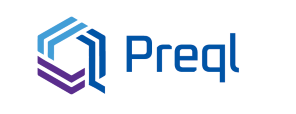

Preql (*pronounced: Prequel*) is an interpreted relational query language.

It is designed for use by data engineers, analysts and data scientists.

* Compiles to SQL at runtime. It has the performance and abilities of SQL, and much more.

    * Support for Postgres, MySQL and Sqlite. (more planned!)

    * Escape hatch to SQL, for all those database-specific features we didn't think to include

* Programmer-friendly syntax and semantics, with gradual type-checking, inspired by Typescript and Python

* Interface through Python, HTTP or a terminal environment with autocompletion


**Note: Preql is still work in progress, and isn't ready for production use, or any serious use yet**

# Documentation

[Read here](https://preql.readthedocs.io/en/latest/)

# Get started

Simply install via pip:

```sh
    pip install -U prql
```

Then just run the interpreter:

```sh
    preql
```

Requires Python 3.8+

[Read more](https://preql.readthedocs.io/en/latest/getting-started.html)

# Quick Example

```javascript
// Sum up all the squares of an aggregated list of numbers
// Grouped by whether they are odd or even
func sqrsum(x) = sum(x * x)
func is_even(x) = x % 2 == 0

print [1..100]{
        is_even(item) => sqrsum(item)
      }
// Result is:
┏━━━━━━━━━┳━━━━━━━━┓
┃ is_even ┃ sqrsum ┃
┡━━━━━━━━━╇━━━━━━━━┩
│       0 │ 166650 │
│       1 │ 161700 │
└─────────┴────────┘
```

In the background, this was run by executing the following SQL code (reformatted):

```sql
  WITH range1 AS (SELECT 1 AS item UNION ALL SELECT item+1 FROM range1 WHERE item+1<100)
     , subq_3(is_even, sqrsum) AS (SELECT ((item % 2) = 0) AS is_even, SUM(item * item) AS sqrsum FROM range1 GROUP BY 1)
  SELECT * FROM subq_3
```

# License

Preql uses an “Interface-Protection Clause” on top of the MIT license.

See: [LICENSE](LICENSE)

In simple words, it can be used for any commercial or non-commercial purpose, as long as your product doesn't base its value on exposing the Preql language itself to your users.

If you want to add the Preql language interface as a user-facing part of your commercial product, contact us for a commercial license.
