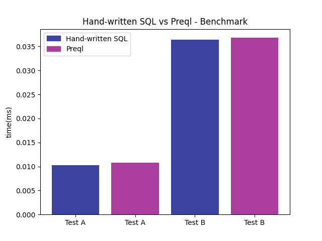

# Performance

## Components

For understanding performance, Preql should be considered as split into two components:

| Component  | Type | Performance | Responsibility
| -          |  -   | -           |
| **Interpreter** | Procedural | Very slow | Control flow, and invoking the SQL Backend.
| **SQL Backend** | Relational | Equivalent to SQL* | Compiling to SQL, and executing it.

In a typical Preql program, most of the time will be spent in executing SQL, rather than in the interpreter.

Running SQL through Preql adds a constant-time cost, due to real-time compilation. This may be noticeable in very fast queries, such as fetching a single row by id.

Future versions of Preql will cut the constant-time cost significantly, by caching the compiled SQL (a poc is already working).

## Benchmarks

### Comparison to hand-written SQL

The following benchmark compared the performance of hand-written SQL queries to Preql-generated SQL (without compilation costs).

The code is available on [benchmark/test_chinook.py]([https://github.com/erezsh/Preql/blob/master/benchmark/test_chinook.py])

Results for Sqlite3 (1000 iterations):

